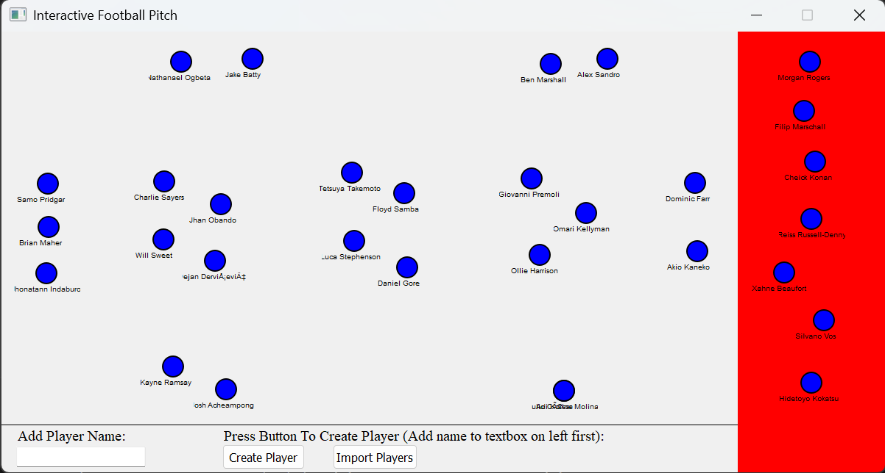

# Football Manager Squad Map
### Use
* Creates a visual map of all players and where they play on the field from your squad
* Identify areas of weakness or areas with too many players
* Can add players in individually or import your squad in from football manager
* Contains an extra area to put players to send on loan or transfer list

### Example Use Case

* The players in the red section are ones to loan or transfer, where as the one in the white section will be registered into the squad

### Imperfections
* When players are uploaded they are assigned a location on the screen based on their best position assign from football manager. This position may not be the one you want them to play in so you will have to drag them to where you'd like.
* There is an area around a player that you can click on to drag the player, not just on the circle. However, some players names are so long that they do not fit in the area and are cut off (see image above).
* Some characters to not import correctly from football manager (see image above).